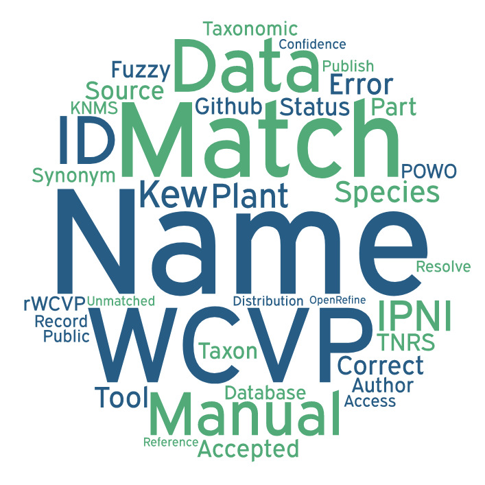

## Other Reconciliation Methods at Kew

Note this is not exhaustive

### rWCVP
- Software/Platform: R
- Which resource(s) it matches to: WCVP
- Link: https://matildabrown.github.io/rWCVP/

### WCVP_taxo
- Software/Platform: Python
- Which resource(s) it matches to: WCVP
- Link: https://github.com/RBGKew/PAFTOL_Validation_Pipeline

### OpenRefine
- Software/Platform: API (which can be accessed e.g. with Python) and GUI
- Which resource(s) it matches to: IPNI
- Link: https://github.com/RBGKew/Reconciliation-and-Matching-Framework

### wcvp-gbif-processing
- Software/Platform: Python
- Match GBIF and WCVP taxonomies, such that an assessment of GBIF holdings can be made using the WCVP taxonomy.
- Link: https://github.com/OA-WCVP/wcvp-gbif-processing

### Kew Names Matching Service (KNMS) 
- Software/Platform: Web portal
- Developed in 2018 and not currently maintained. Some info and usage example can be found at: https://barnabywalker.github.io/kewr/articles/KNMS.html
- Link: http://namematch.science.kew.org/ 

### Kewr 
- Software/Platform: R
- R package to interface with Kew resources like KNMS 
- Link: https://github.com/barnabywalker/kewr 

## Outside of Kew, with Kew collaboration
## TNRS
- Software/Platform: Web portal and R package
- Which resource(s) it matches to: WFO and WCVP
- https://tnrs.biendata.org/

